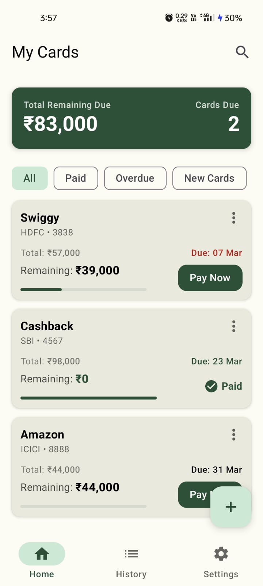
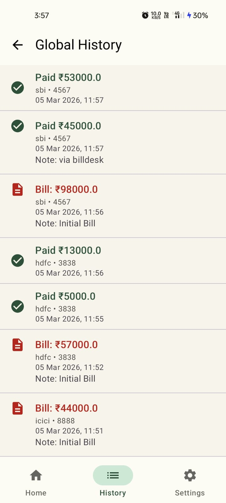
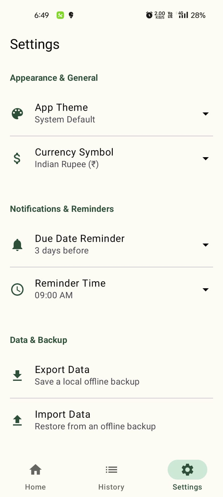
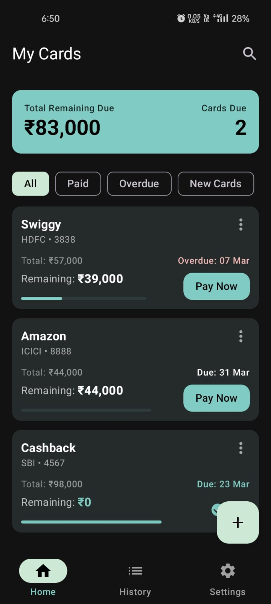

<div align="center">
  
  <h1>DueNot</h1>
  <p><b>A modern, offline-first credit card bill management and reminder app for Android.</b></p>
</div>

<div align="center">
  
  <a href="https://github.com/govin9/DueNot/releases">
    
  </a>
  <a href="https://github.com/govin9/DueNot/blob/main/LICENSE">
    
  </a>
  
  

</div>

---

## 📌 About

**DueNot** is a robust, privacy-focused application designed to help you stay on top of your credit card finances. It helps you track your due dates, manage payments, and monitor your remaining balances—all without compromising your privacy.

Built with modern Android development practices, DueNot ensures a seamless and responsive user experience.

## ✨ Features

- **💳 Manage Your Cards:** Easily add, edit, and delete your credit cards. Keep track of all your cards in one unified dashboard.
- **📊 Payment Tracking:** Record your payments, whether full or partial, and view your complete payment history.
- **⏳ Stay Organized:** Never miss a payment deadline by keeping a close eye on your due dates. Visually track your "Total Due" and "Remaining Due" with intuitive progress indicators.
- **🔒 100% Offline & Private:** No internet connection is required. All your financial data is stored securely on your device using a local Room database. We respect your privacy—no tracking, no analytics, no ads.
- **💾 Data Backup & Restore:** Securely export your data as a JSON file and import it back whenever you need, ensuring your data is safe even if you change devices or reinstall the app.
- **🎨 Clean & Modern UI:** A beautiful, intuitive interface built entirely with Jetpack Compose (Material Design 3).
- **🛡️ Free & Open Source:** Complete transparency. You can view the source code, verify its security, and contribute to the project.

## 📸 Screenshots
<table align="center">
  <tr>
    <td></td>
    <td></td>
  </tr>
  <tr>
    <td></td>
    <td></td>
  </tr>
</table>

## 🛠️ Tech Stack & Architecture

DueNot is built using the recommended modern Android tech stack:

- **Language:** [Kotlin](https://kotlinlang.org/)
- **UI Toolkit:** [Jetpack Compose](https://developer.android.com/jetpack/compose)
- **Architecture:** MVVM (Model-View-ViewModel) + Clean Architecture principles
- **Local Storage:** [Room Database](https://developer.android.com/training/data-storage/room)
- **Preferences:** [Jetpack DataStore](https://developer.android.com/topic/libraries/architecture/datastore)
- **Navigation:** [Navigation Compose](https://developer.android.com/jetpack/compose/navigation)
- **Asynchronous Programming:** Kotlin Coroutines & Flow
- **CI/CD:** Automated builds and release generation using GitHub Actions (F-Droid compatible build process)

## 🚀 Getting Started

### Prerequisites
- Android Studio (latest stable version recommended)
- JDK 17+
- Android SDK 34

### Build Instructions

You can build the app using Android Studio or via the command line.

**Using Command Line (CLI):**
1. Clone the repository:
   ```bash
   git clone https://github.com/govin9/DueNot.git
   ```
2. Navigate to the project directory:
   ```bash
   cd DueNot
   ```
3. Build the Debug APK:
   ```bash
   ./gradlew assembleDebug
   ```
4. Build the Release APK (requires signing configuration):
   ```bash
   ./gradlew assembleRelease
   ```

**Using Android Studio:**
1. Open the cloned project in Android Studio.
2. Let Gradle sync the project files.
3. To test the app locally, ensure the `debug` build variant is selected from the "Build Variants" tool window.
4. Click "Run" to build and install the app on your emulator or physical device.

## 🤝 Contributing

Contributions are always welcome! If you have any ideas, suggestions, or bug reports, please feel free to open an issue or submit a pull request.

1. Fork the Project
2. Create your Feature Branch (`git checkout -b feature/AmazingFeature`)
3. Commit your Changes (`git commit -m 'Add some AmazingFeature'`)
4. Push to the Branch (`git push origin feature/AmazingFeature`)
5. Open a Pull Request

## 📄 License

This project is licensed under the MIT License - see the [LICENSE](LICENSE) file for details.
